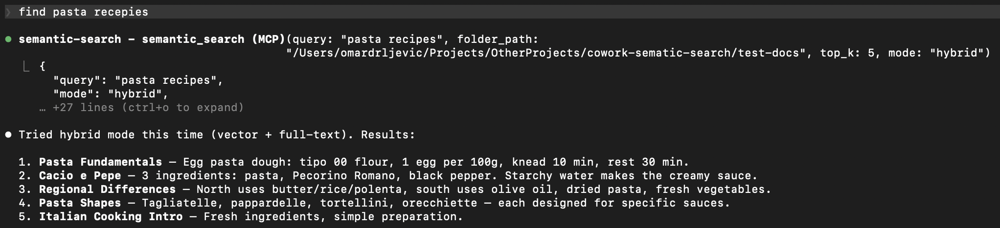

# cowork-semantic-search

[](https://www.python.org/downloads/)
[](LICENSE)
[](https://modelcontextprotocol.io)

**Local semantic search for your documents. No API keys. No cloud. Works with any MCP client.**



---

## Why

AI coding tools are powerful, but they have blind spots when it comes to your local files:

- **Frozen knowledge** -- training data has a cutoff. Your latest reports, notes, and contracts don't exist in the model's world.
- **Context window limits** -- you can't paste 500 documents into a prompt.
- **No cross-file search** -- your AI tool can read one file at a time, but can't search across your entire document library for the relevant pieces.

This plugin bridges that gap. It indexes your local documents into a small, fast vector database. When you ask a question, it retrieves only the relevant pieces -- so your AI tool can answer with your actual data.

```
Your documents --> chunked --> embedded --> local vector DB
                                                 |
         Your question --> embedded --> similarity search --> relevant chunks --> AI answers
```

## Features

- **Fully offline** -- one-time model download (~120MB), then no network calls. No data leaves your machine.
- **Incremental indexing** -- SHA-256 content hashing. Only changed files get reprocessed. Re-indexing 1000 files where 3 changed takes seconds.
- **Multilingual** -- handles 50+ languages natively. Search in one language, find results in another.
- **Hybrid search** -- combines semantic similarity with full-text keyword search via Reciprocal Rank Fusion. Catches what pure vector search misses.
- **Multiple formats** -- txt, md, pdf, docx, pptx, csv out of the box.
- **Any MCP client** -- works with Claude Code, Cursor, Windsurf, Cline, and any other MCP-compatible tool.
- **Zero infrastructure** -- LanceDB stores everything as local files. No server, no Docker, no database to manage.

## Supported Formats

| Format | Extension | Details |
|--------|-----------|---------|
| Plain text | `.txt` | UTF-8 with fallback |
| Markdown | `.md` | Raw text preserved |
| PDF | `.pdf` | Page-level extraction with metadata |
| Word | `.docx` | Full paragraph extraction |
| PowerPoint | `.pptx` | Slide-level extraction with metadata |
| CSV | `.csv` | Row-based text extraction |

## Quick Start

### 1. Install

```bash
git clone https://github.com/ZhuBit/cowork-semantic-search.git
cd cowork-semantic-search
python3 -m venv .venv && source .venv/bin/activate
pip install -e ".[all]"
```

### 2. Configure your MCP client

Add the server to your MCP client's config. Replace paths with your own.

<details>
<summary><strong>Claude Code</strong> -- <code>.mcp.json</code> in your project root</summary>

```json
{
  "mcpServers": {
    "semantic-search": {
      "command": "/absolute/path/to/.venv/bin/python",
      "args": ["-m", "server.main"],
      "cwd": "/absolute/path/to/cowork-semantic-search",
      "env": {
        "PYTHONPATH": "/absolute/path/to/cowork-semantic-search"
      }
    }
  }
}
```
</details>

<details>
<summary><strong>Cursor</strong> -- <code>.cursor/mcp.json</code> in your project root or <code>~/.cursor/mcp.json</code> globally</summary>

```json
{
  "mcpServers": {
    "semantic-search": {
      "command": "/absolute/path/to/.venv/bin/python",
      "args": ["-m", "server.main"],
      "env": {
        "PYTHONPATH": "/absolute/path/to/cowork-semantic-search"
      }
    }
  }
}
```
</details>

<details>
<summary><strong>Windsurf</strong> -- <code>~/.codeium/windsurf/mcp_config.json</code></summary>

```json
{
  "mcpServers": {
    "semantic-search": {
      "command": "/absolute/path/to/.venv/bin/python",
      "args": ["-m", "server.main"],
      "env": {
        "PYTHONPATH": "/absolute/path/to/cowork-semantic-search"
      }
    }
  }
}
```
</details>

<details>
<summary><strong>Cline</strong> -- MCP Servers settings in the Cline VS Code extension</summary>

Open Cline > MCP Servers icon > Configure > Advanced MCP Settings, then add:

```json
{
  "mcpServers": {
    "semantic-search": {
      "command": "/absolute/path/to/.venv/bin/python",
      "args": ["-m", "server.main"],
      "env": {
        "PYTHONPATH": "/absolute/path/to/cowork-semantic-search"
      }
    }
  }
}
```
</details>

### 3. Restart your MCP client and go

> "Index all documents in ~/Documents/projects"

> "Search for 'quarterly revenue report'"

First run downloads the embedding model (~120MB), then everything runs offline.

## Example: Search Your Obsidian Vault

If you keep notes in Obsidian (or any folder of markdown files), this plugin turns your AI tool into a search engine for your knowledge base.

```
You: "Index my vault at ~/Documents/ObsidianVault"
AI:  Indexed 847 files -> 3,291 chunks in 42s

You: "What did I write about API rate limiting?"
AI:  Found 6 relevant chunks across 3 files:
       - notes/backend/rate-limiting-strategies.md
       - projects/acme-api/design-decisions.md
       - daily/2025-11-03.md
       ...

You: "Find anything about the client meeting last November, use hybrid search"
AI:  Found 4 results using hybrid search (vector + keyword):
       - meetings/2025-11-12-acme-kickoff.md
       - daily/2025-11-12.md
       ...
```

Works the same with PDFs, Word docs, PowerPoints, and CSVs -- just point it at a folder.

## Tools

| Tool | Description |
|------|-------------|
| `index_folder` | Index or re-index all documents in a folder. Incremental -- skips unchanged files. |
| `semantic_search` | Search indexed documents using natural language. Supports `vector` and `hybrid` modes. |
| `get_index_status` | Show total chunks, file count, and list of indexed files. |
| `reindex_file` | Force re-index a single file, bypassing the hash cache. |

## How It Works

1. **Parse** -- extract text from each document, preserving structure (pages, slides)
2. **Chunk** -- split into ~400 character overlapping pieces for precise retrieval
3. **Embed** -- convert each chunk into a 384-dimensional vector using `paraphrase-multilingual-MiniLM-L12-v2`
4. **Store** -- save chunks + vectors in a LanceDB database (a local file, no server needed)
5. **Search** -- embed your query, find nearest chunks by cosine similarity, optionally combine with full-text keyword search via RRF

## Advanced Usage

<details>
<summary><strong>Use as a Python library</strong></summary>

```python
from server.indexer import index_folder
from server.search import semantic_search

# Index a folder
result = index_folder("/path/to/docs")
print(f"{result['files_indexed']} files -> {result['total_chunks']} chunks")

# Search
results = semantic_search("project deadline", mode="hybrid")
for r in results["results"]:
    print(f"  {r['file_name']}: {r['text'][:100]}...")
```
</details>

## Architecture

```
server/
  main.py       # MCP server + tool definitions
  parsers.py    # Per-format text extraction
  chunker.py    # Text splitting with metadata
  indexer.py    # Discovery, hashing, embedding pipeline
  store.py      # LanceDB vector store + FTS + hybrid search
  search.py     # Query embedding + search orchestration
```

| Component | Choice | Why |
|-----------|--------|-----|
| MCP framework | FastMCP | Clean tool definitions, async support |
| Embeddings | sentence-transformers | Offline, multilingual, fast |
| Vector DB | LanceDB | Serverless, embedded, FTS built-in |
| Chunking | langchain-text-splitters | Battle-tested recursive splitting |
| PDF | PyMuPDF | Fast, accurate extraction |
| DOCX | python-docx | Lightweight, no system deps |
| PPTX | python-pptx | Slide-level extraction |

## Development

```bash
source .venv/bin/activate
pytest tests/ -v
```

56 tests covering parsers, chunking, indexing, search, and MCP tool integration.

Contributions welcome -- open an issue or submit a PR.

## Roadmap

- ONNX runtime for faster embeddings (drop PyTorch dependency)
- Configurable chunk size and overlap via tool params
- Multi-folder named indexes
- Metadata filtering (date ranges, tags, custom fields)
- Watch mode (auto-reindex on file changes)

## License

AGPL-3.0 -- free to use, modify, and self-host. If you offer this as a network service, you must share your source code. See [LICENSE](LICENSE) for details.
